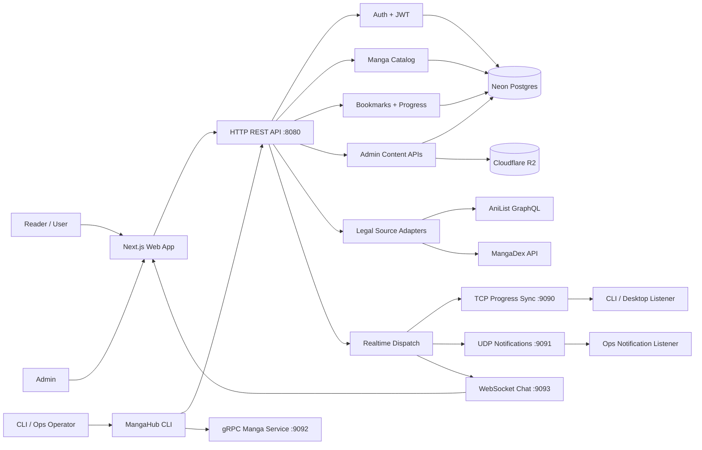
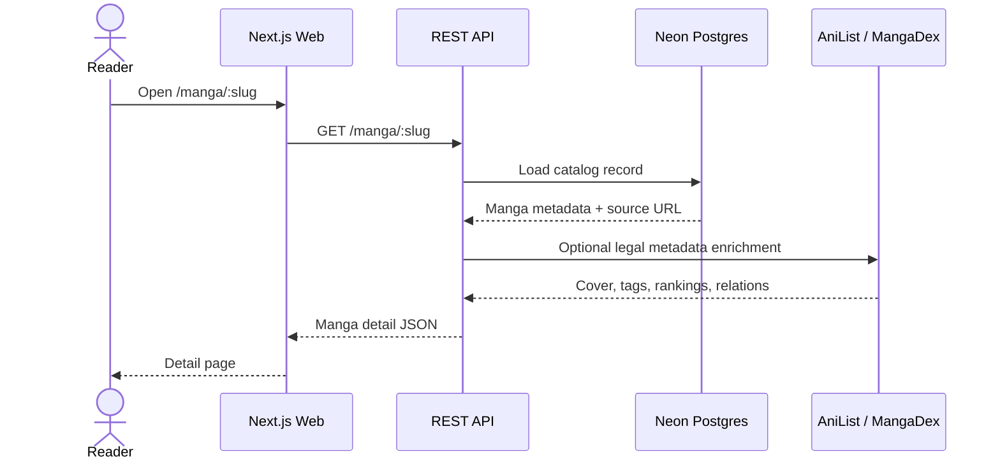
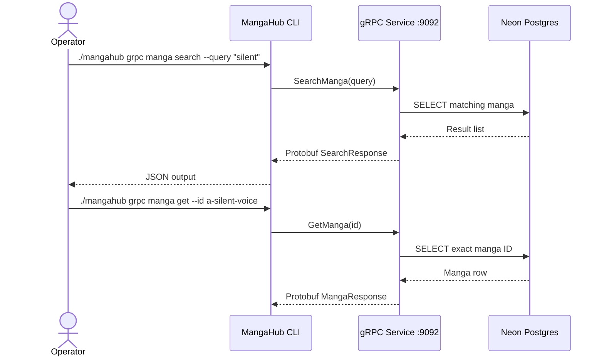
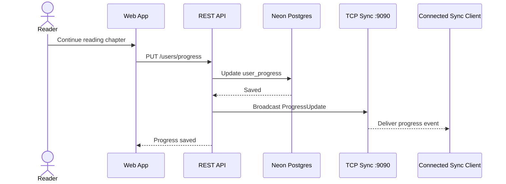
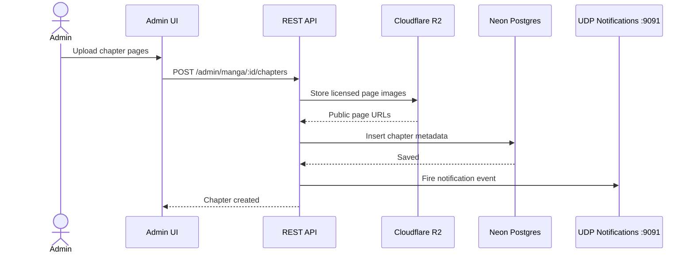
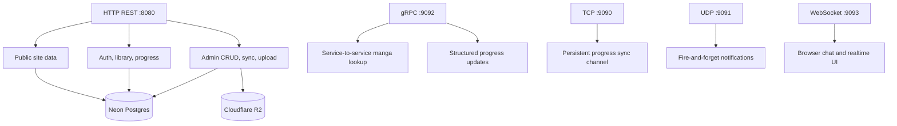

# MangaHub

MangaHub is a production-shaped manga tracking and reader platform built around the Net-centric Programming reference PDFs. It keeps the required protocol work visible while using the current project stack: Next.js, Go, Neon Postgres, Cloudflare R2, JWT auth, and legal metadata enrichment through the backend.

## Documentation

- [Setup Instructions](docs/setup.md)
- [API Documentation](docs/api.md)
- [Architecture Overview](docs/architecture.md)
- [Production Setup](docs/production.md)

The docs map the implementation to:

- `mangahub_project_spec (1).pdf`
- `mangahub_usecase (reference) (1).pdf`
- `mangahub_cli_manual (reference) (1).pdf`

## What Is Implemented

- Next.js product website, reader, admin UI, and docs reader in `apps/web`
- Go API and protocol services in `services/api`
- HTTP REST API for auth, manga, chapters, library, progress, admin CRUD, source enrichment, and notifications
- TCP progress sync, UDP notifications, gRPC manga/progress service, and WebSocket chat service
- Neon Postgres support through `DATABASE_URL`
- SQLite fallback for local development
- Cloudflare R2 storage for licensed uploads and app-owned media through `STORAGE_PROVIDER=r2`
- AniList GraphQL and MangaDex REST metadata enrichment through backend endpoints
- Role-gated admin manga/chapter create, update, delete, sync, and upload flows

## Media Policy

Seeded manga records are metadata-only. MangaHub does not import chapter pages from third-party scan sites and does not mirror third-party AniList or MangaDex cover images into R2. R2 is for licensed uploads and app-owned media such as chapter pages, publisher/admin cover overrides, avatars, import bundles, and generated derivatives.

The static seed preserves the status values retrieved from AniList metadata instead of manually relabeling completed titles to improve the visible mix. Use the backend AniList or MangaDex sync/admin flows to add current ongoing or hiatus titles when the demo catalog needs broader status coverage.

MangaDex cover art is resolved from the `cover_art` relationship. The API returns a cover file name, and MangaHub builds the CDN URL as `https://uploads.mangadex.org/covers/{mangaId}/{fileName}`. Chapter pages are separate from cover metadata and are only served from app-owned storage after an authorized import/upload.

## Quick Start

Install dependencies:

```bash
npm install
```

Run the Go API:

```bash
npm run api:dev
```

Run the website:

```bash
NEXT_PUBLIC_API_URL=http://localhost:8080 npm run dev --workspace apps/web -- --hostname 127.0.0.1 --port 3000
```

Open `http://127.0.0.1:3000`.

Run migrations:

```bash
npm run api:migrate
```

Test R2:

```bash
npm run api:storage-check
```

## Default Ports

- Website: `3000`
- HTTP API: `8080`
- TCP sync: `9090`
- UDP notifications: `9091`
- gRPC internal service: `9092`
- WebSocket chat: `9093`

## Service Workflows

### Role And Service Topology



### Reader Manga Detail



### CLI And gRPC



### Progress Sync Over TCP



### Admin Upload And UDP Notification



### Protocol Responsibilities


